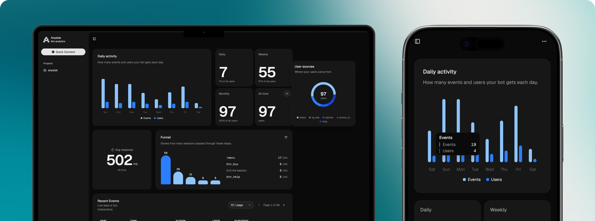

<div align='center'>

<h1 style='border-bottom: none; margin-bottom: -5px'>Anystat</h1>

**Lightweight, privacy-first analytics for Telegram bots built with [aiogram 3](https://github.com/aiogram/aiogram).**

[](https://pypi.org/project/anystat/)
[](https://pypi.org/project/anystat/)
[](LICENSE)
[](https://github.com/ivan-nechaev/anystat-python/actions/workflows/ci.yml)

English | [Русский](README.ru.md)
</div>

<p align="center">
  <a href="https://anystat.me"></a>
</p>


Add two lines of code and see how people actually use your bot: `/start` sources and deep links, command usage, button clicks, blocks and unblocks — all in your [Anystat](https://anystat.me) dashboard.

```python
anystat = Anystat(api_key="YOUR_API_KEY")
setup_anystat(dp, anystat)
```

## Why Anystat

- **Two-line integration.** One middleware, zero changes to your handlers.
- **Privacy by default.** Message text is *not* collected unless you explicitly opt in. No user profile data is collected.
- **Nothing hidden.** Turn on `debug=True` and the SDK logs every event it captures, every payload it sends, and everything it *skips* — verify it yourself.
- **Fire and forget.** Events are batched, retried with backoff, and never block your handlers. If analytics fails, your bot keeps working.
- **Fully typed.** Ships with `py.typed` — autocomplete and type checking out of the box.

## Installation

```bash
pip install anystat
```

or with [uv](https://github.com/astral-sh/uv):

```bash
uv add anystat
```

Requires **Python 3.12+** and **aiogram 3**.

## Quickstart

```python
import asyncio
from aiogram import Bot, Dispatcher
from anystat import Anystat, setup_anystat


async def main():
    bot = Bot(token="YOUR_BOT_TOKEN")
    dp = Dispatcher()

    anystat = Anystat(api_key="YOUR_ANYSTAT_API_KEY")   # 1
    setup_anystat(dp, anystat)                          # 2
    dp.shutdown.register(anystat.close)  # flush pending events on shutdown

    # ... register your handlers as usual ...

    await dp.start_polling(bot)


asyncio.run(main())
```

That's it. Auto-tracking starts immediately — no changes to your handlers required.

You can also provide the API key via the `ANYSTAT_API_KEY` environment variable and create the client with just `Anystat()`.

## What gets tracked

| Event | Default | What it gives you |
|---|---|---|
| `/start` command | ✅ on | New users and deep-link parameters (`t.me/yourbot?start=campaign_x`) — track where users come from |
| Other commands | ✅ on | Which commands people actually use |
| Callback queries | ✅ on | Inline button clicks |
| Bot blocked / unblocked | ✅ on | Churn: when users block or return to your bot |
| Text messages | ❌ **off** | Full message text — opt-in only, see below |

Every event includes the user ID, a timestamp, and how long your handler took to process the update (in ms).

### What is NOT collected

- **Message text** — unless you explicitly set `track_messages=True`.
- **User profile data** (username, name, language) — profile collection is disabled in this version.
- Anything else. Don't take our word for it — run with `debug=True` and watch every byte that leaves your bot.

## Custom events

Track anything that matters to your bot with `track()`:

```python
from aiogram import types
from aiogram.filters import Command


@dp.message(Command("buy"))
async def buy_handler(message: types.Message):
    # ... your logic ...
    await anystat.track(
        "purchase",
        user_id=message.from_user.id,
        amount=99,
        currency="USD",
    )
```

The first argument is the event name, the second is the user ID (or `None` for system events). Any extra keyword arguments become event properties — pass anything JSON-serializable.

## Configuration

Pass options directly:

```python
anystat = Anystat(
    api_key="YOUR_API_KEY",
    track_messages=True,
    debug=True,
)
```

or group them in a config object:

```python
from anystat import Anystat, AnystatConfig

config = AnystatConfig(track_messages=True, debug=True)
anystat = Anystat(api_key="YOUR_API_KEY", config=config)
```

Options passed directly to `Anystat(...)` override the config.

| Option | Default | Description |
|---|---|---|
| `debug` | `False` | Log everything the SDK collects and sends (see below) |
| `track_start` | `True` | Auto-track the `/start` command and its deep-link parameter |
| `track_command` | `True` | Auto-track all other commands |
| `track_callback_query` | `True` | Auto-track inline button clicks |
| `track_messages` | `False` | Auto-track incoming text messages, **including their text** |

## Debug mode: see exactly what leaves your bot

Trust, but verify. With `debug=True` the SDK logs every event it captures, every event it skips (and why), and the exact payload of every request:

```
[anystat] endpoint: https://api.anystat.me | api key: any_…7f2c
[anystat] auto-tracking: /start=on commands=on callbacks=on messages=off
[anystat] message text is NOT collected (track_messages=off)
[anystat] capture start_command via AnystatMiddleware:
{
  "event_type": "start_command",
  "user_id": 12345,
  "received_at": 1767225600,
  "duration": 12,
  "message_id": 42,
  "start_param": "campaign_x"
}
[anystat] skip message from user=12345 (track_messages=off, text not collected)
[anystat] → POST /v1/collect/events (2 events)
[anystat] ← 200 in 143 ms
```

Debug output goes through the standard `logging` module under the `"anystat"` logger. If you've already configured logging in your app, Anystat respects your handlers and formatting; otherwise it sets up a minimal `[anystat]` console handler for you.

## Reliability

Analytics should never be the reason your bot breaks:

- **Batching.** Events are buffered in memory and sent in batches (up to 30 events or every 60 seconds), not one HTTP request per update.
- **Retries.** Network errors and retryable status codes (429, 5xx, …) are retried with exponential backoff and jitter.
- **Non-blocking.** Tracking runs after your handler finishes, so it never delays replies to users.
- **Fail-safe.** If the Anystat API is unreachable after retries, events are dropped with a warning in the logs — your bot keeps running.

Call `await anystat.close()` on shutdown (or register it as shown in the quickstart) to flush any buffered events before the process exits.

## Requirements

- Python 3.12+
- aiogram >= 3.28

## License

[MIT](LICENSE)